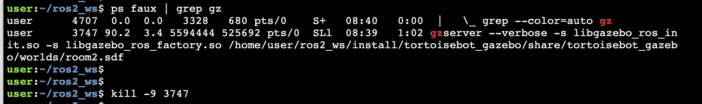

# Checkpoint 24 — `ros1_ci` (ROS 1 Continuous Integration)

Jenkins + Docker **Continuous Integration** pipeline for the **ROS 1 (Noetic)** TortoiseBot waypoints action server from Checkpoint 23. A Freestyle Jenkins job builds a purpose-built Docker image, launches **Gazebo headless** via **Xvfb**, starts the `tortoisebot_action_server`, runs the `rostest` node-level test suite, and reports pass/fail back to Jenkins. Triggered automatically whenever a new commit (or merged Pull Request) lands on `main`.

- **Repository under test**: `https://github.com/mathrosas/ros1_testing`
- **Packages**: `tortoisebot`, `tortoisebot_waypoints`
- **Tests**: Python 3 `rostest` node-level tests (final position + final yaw)

<p align="center">
  
</p>

## How It Works

1. **Jenkins** polls `https://github.com/mathrosas/ros1_ci` every minute (`* * * * *`) and triggers a build on new commits
2. **Docker build** — `Dockerfile` starts from `osrf/ros:noetic-desktop`, installs Gazebo + `rostest` + `xvfb`, clones `ros1_testing` into `/simulation_ws/src`, fixes the Python 3 shebang on the action server, and `catkin_make`s the workspace
3. **Docker run** — `entrypoint.sh` starts Xvfb on `:1`, launches `tortoisebot_gazebo/tortoisebot_playground.launch gui:=false`, waits for the ROS master + Gazebo topics, starts the action server, waits for `/tortoisebot_as`
4. **Tests** — `rostest tortoisebot_waypoints waypoints_test.test --reuse-master` runs against the live sim
5. **Teardown** — kills the action server, `gzserver`, `gzclient`, and `Xvfb`; exits with the rostest result code so Jenkins marks the build red/green accordingly

## Project Structure

```
ros1_ci/
├── Dockerfile           # osrf/ros:noetic-desktop + Gazebo + rostest + xvfb + ros1_testing clone + catkin_make
├── entrypoint.sh        # Xvfb → Gazebo → action server → rostest → cleanup
├── run_jenkins.sh       # Helper: installs OpenJDK 17, downloads jenkins.war, launches Jenkins
├── media/
└── README.md
```

## Jenkins Setup

### Start Jenkins

```bash
bash run_jenkins.sh
```

The script sets `JENKINS_HOME=~/webpage_ws/jenkins/`, installs OpenJDK 17, downloads `jenkins.war` (v2.463), and launches Jenkins in the background. The Jenkins URL and PID are written to `~/jenkins__pid__url.txt`.

Unlock with the initial admin password at `~/webpage_ws/jenkins/secrets/initialAdminPassword`, install suggested plugins, then log in with the lab credentials:

- **Username**: `admin`
- **Password**: `password`

> ⚠️ Lab-only credentials — do not reuse in any public or production environment.

### Create the job

1. **Dashboard → New Item → Freestyle project** — e.g. `ROS 1 CI – Tortoisebot Waypoints`
2. **Source Code Management → Git**
   - Repository URL: `https://github.com/mathrosas/ros1_ci`
   - Branches to build: `main`
3. **Build Triggers → Poll SCM**: `* * * * *`
4. **Build**: add the three shell steps below (each as a separate *Execute shell* step)

### Build steps (copy-paste)

**Step 1 — Preflight**

```bash
set -euxo pipefail
whoami && uname -a && docker --version && git --version && df -h

# allow Jenkins to talk to Docker (fine for a lab env)
sudo chmod 666 /var/run/docker.sock || true

docker image prune -f || true
docker container prune -f || true
```

**Step 2 — Build the CI image**

```bash
set -euxo pipefail
docker build --pull -t tortoisebot-ros1-ci \
  --build-arg REPO_URL=https://github.com/mathrosas/ros1_testing.git \
  --build-arg REPO_BRANCH=main \
  .
```

**Step 3 — Run the tests headless**

```bash
set -euxo pipefail
docker rm -f tortoise-ros1-ci >/dev/null 2>&1 || true
docker run --name tortoise-ros1-ci --rm --shm-size=2g -e CI=1 tortoisebot-ros1-ci
```

`--shm-size=2g` keeps Gazebo stable under headless rendering. No `-it` — Jenkins has no TTY.

## Local Quickstart (no Jenkins)

Sanity-check the image before wiring it into Jenkins:

```bash
docker build -t tortoisebot-ros1-ci .
docker run --rm --shm-size=2g -e CI=1 tortoisebot-ros1-ci
```

Expected tail:

```
[ROSTEST]-----------------------------------------------------------------------
[tortoisebot_waypoints.rosunit-test_waypoints/test_final_position][passed]
[tortoisebot_waypoints.rosunit-test_waypoints/test_final_yaw][passed]

SUMMARY
 * RESULT: SUCCESS
 * TESTS: 2
 * ERRORS: 0
 * FAILURES: 0
```

Exit code `0` = tests passed.

## Triggering a Build via Pull Request

1. In the `ros1_ci` GitHub repo, create or edit any file (e.g. `trigger.txt`), commit to a branch, open a Pull Request, and merge it into `main`
2. Within one minute, Poll SCM picks up the new commit and kicks off a Jenkins build
3. Watch the live logs via **Build History → #<n> → Console Output**

<p align="center">
  
</p>

## Prerequisites

- Ubuntu 20.04+ (or any Linux host with Docker + Java)
- **Docker Engine** (Jenkins user must be able to run `docker` — the preflight step `chmod 666`'s the socket as a shortcut)
- **OpenJDK 17** (installed by `run_jenkins.sh`)

Install Docker & enable non-root usage:

```bash
sudo apt-get update
sudo apt-get install -y docker.io docker-compose
sudo service docker start
sudo usermod -aG docker $USER
newgrp docker
```

## Troubleshooting

### Docker permissions

If Jenkins can't reach Docker: `sudo chmod 666 /var/run/docker.sock` (lab shortcut) or add the Jenkins user to the `docker` group.

### Gazebo stuck / lingering `gzserver`

The entrypoint `pkill`s `gzserver` + `gzclient` on exit, but lingering processes on the host can still block the next run:

```bash
ps faux | grep gz
kill -9 <process_id>
```

<p align="center">
  
</p>

### Python 3 shebang

Noetic runs Python 3 — the Dockerfile rewrites the action server shebang from `python` to `python3` and sets the executable bit. If you port the repo elsewhere, keep that fixup.

### Disk pressure

Docker images are heavy. The preflight step prunes dangling images/containers; run `docker system prune -af` occasionally on the host.

### TTY errors in Jenkins

Never add `-it` to `docker run` inside a Jenkins build — Jenkins has no controlling TTY.

## Key Concepts Covered

- **Jenkins Freestyle** job driven by shell steps (Dockerfile + entrypoint do the real work)
- **Headless Gazebo** via `Xvfb` + `DISPLAY=:1` + `gui:=false` — no X server required on the CI host
- **Reproducible ROS build** inside Docker — clone + `catkin_make` baked into the image so every run starts from the same state
- **`rostest` inside CI** — `--reuse-master` so the action server and tests share the Gazebo master started by the entrypoint
- **Poll SCM** as a minimal "build on push / PR merge" trigger (no GitHub webhook required)

## Technologies

- Jenkins LTS (`jenkins.war` 2.463, OpenJDK 17)
- Docker Engine (`osrf/ros:noetic-desktop` base image)
- ROS 1 Noetic + Gazebo 11 (headless via `xvfb`)
- Python 3 (`rospy`, `actionlib`, `tf`)
- `rostest` (`tortoisebot_msgs` custom action)
